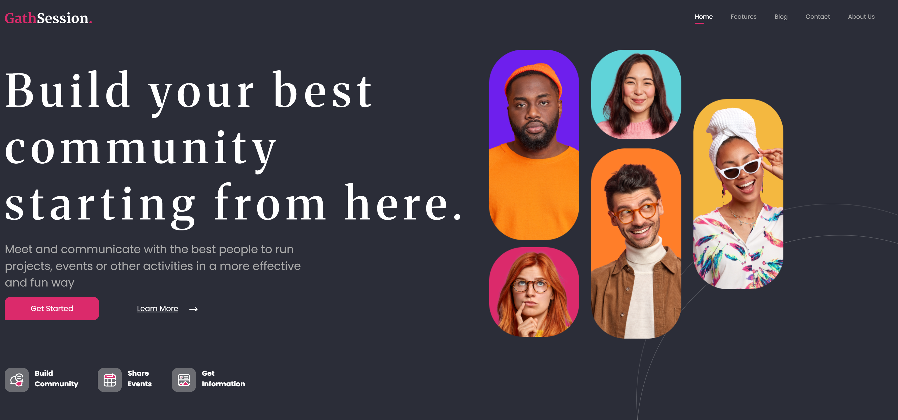

# GathSession
Este proyecto es una plantilla de una pagina de inicio para que puedas montar una comunidad. Se utiliza HTML y CSS.


## Tecnologías
- HTML5
- CSS3
- Sass
- Vite

## Instalación
1. Clona este repositorio
```bash
git clone https://github.com/IanBejenaru/GathSession.git